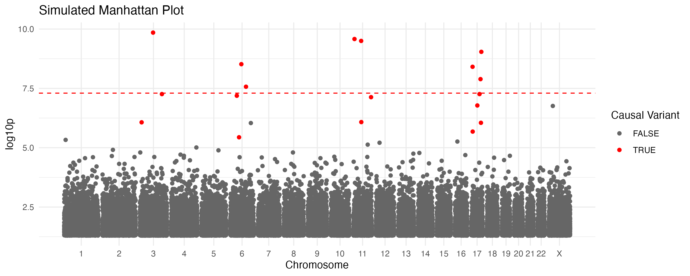
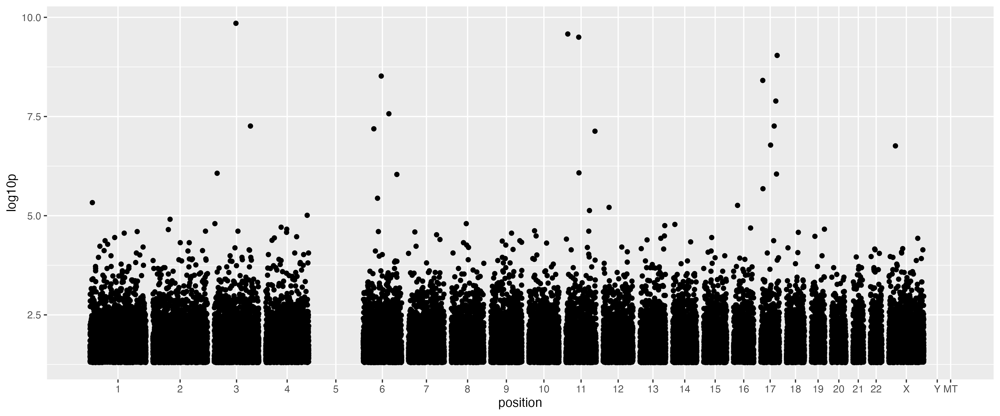
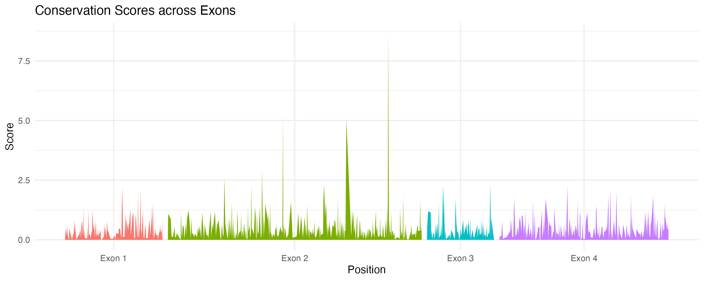
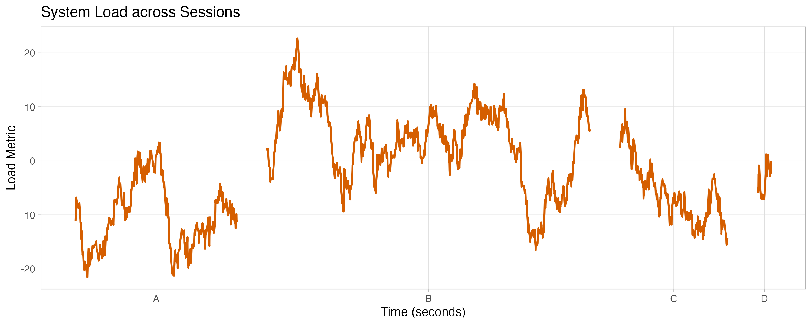

# coord_serial - plot grouped serial data along a continuous axis

<!-- badges: start -->
[](https://github.com/daniel-wells/coord_serial/actions/workflows/R-CMD-check.yaml)
<!-- badges: end -->

This is an R package - an extension of the `ggplot2` package - for plotting data along a continuous axis composed of multiple discrete domains (e.g. chromosomes in a Manhattan plot), using a grammar of graphics approach.

Most current approaches require either manual pre-calculation of the new axis, or use a wrapper function which limits the customisability of the ggplot framework.

The idiomatic `ggplot2` approach is to provide a new coordinate system, `coord_serial()`, that can be used with `ggplot2` to plot data along a single axis.

The benefits of this approach are:
- no bespoke data pre-processing
- full interoperability with other `ggplot2` components

## Example

While `coord_serial` is general-purpose, it is often used for genetics data like manhattan plots. Here is a concrete example using simulated GWAS data:

```r
library(coord.serial)
library(ggplot2)

# genetics-specific example data
simulated_gwas <- simulate_gwas(p_max=0.05)

# plot using the generalized coord_serial()
p <- ggplot(simulated_gwas, aes(x = position,
                                y = log10p,
                                domain = chrom,
                                colour = causal)) +
    geom_point() +
    coord_serial()

# extra formatting
p + scale_color_manual(values = c("TRUE" = "red", "FALSE" = "grey40")) +
    theme_minimal() +
    labs(x = "Chromosome", color = "Causal Variant") +
    geom_hline(yintercept = 7.3, linetype = "dashed", color = "red")

ggsave('man/figures/manhattan.png', width = 12, height = 5)
```



### Scaffolding (fixed domain lengths)

By default, the length of each domain is calculated from the the input data. However, you can provide a `scaffold` (a named vector) to specify fixed lengths. This is particularly useful to spot missing data in QC.

The package provides built-in scaffolds for human genome assemblies: `grch37` and `grch38`.

```r
# Use the built-in GRCh38 scaffold
p = ggplot(simulated_gwas[simulated_gwas$chrom != "5", ], aes(x = position, y = log10p, domain = chrom)) +
    geom_point() +
    coord_serial(scaffold = grch38)
ggsave('man/figures/manhattan_scaffold.png', p, width = 12, height = 5)
```



## genomic domain visualization (Exons)
An alternative use case within genomics is visualisation of data across exons of a gene.

```r
# Simulate conservation scores for exons of varying lengths
exon_data <- simulate_serial(
    n = 1000, 
    domains = c("Exon 1", "Exon 2", "Exon 3", "Exon 4"), 
    domain_lengths = c(120, 300, 80, 200)
)

ggplot(exon_data, aes(x = position, y = log10p, domain = domain, fill = domain)) +
    geom_area(show.legend = FALSE) +
    coord_serial() +
    theme_minimal() +
    labs(title = "Conservation Scores across Exons", x = "Position", y = "Score")
```



## non-genomic time series
Outside of genomics, `coord_serial` can be used for plotting data across "blocks" of time or space into a single continuous view. Here is an example of monitoring system activity across sessions with different durations.

```r
# Simulate activity metrics for sessions with different durations (seconds)
sessions <- simulate_serial(
    n = 2000,
    domains = c("A", "B", "C", "D"),
    domain_lengths = c(3600, 7200, 2400, 300)
)
# Add a random walk per session with randomized starting points
sessions$metric <- ave(rnorm(nrow(sessions)), sessions$domain, FUN = function(x) {
    cumsum(x) + runif(1, -10, 10)
})

ggplot(sessions, aes(x = position, y = metric, domain = domain, color = domain)) +
    geom_line(show.legend = FALSE) +
    coord_serial() +
    theme_light() +
    labs(title = "System Load across Sessions", x = "Time (seconds)", y = "Load Metric")
```



## Installation

```r
remotes::install_github("daniel-wells/coord_serial")
```
