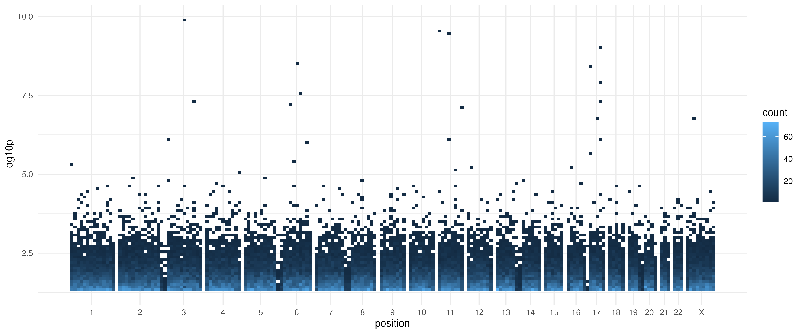
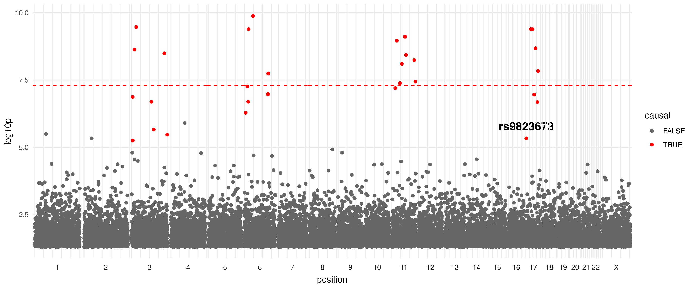
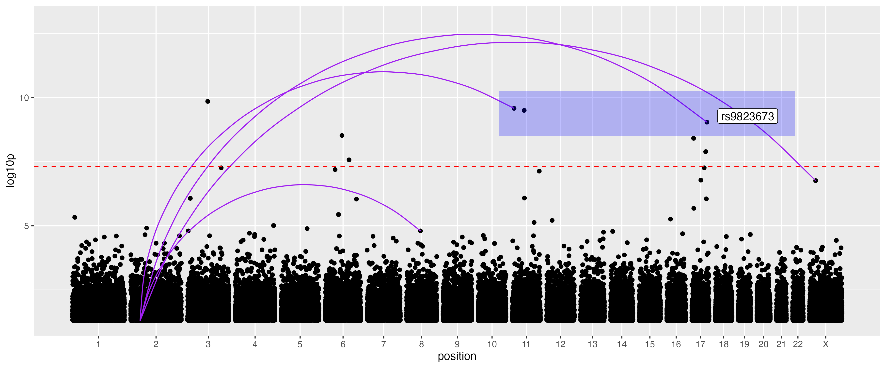

A Manhattan plot in the field of genetics is a standard plot to display the result of a GWAS (genome wide association study).

ggplot2 is an R implementation of the grammar of graphics, a powerful way to specify and generate plots. Also avaliable in Python via the plotnine package.

However, the current implementations of Manhattan plots don't fully embrace this system.

## The ggplot philosophy

The ggplot (gg = grammar of graphics) philosphy is to declaratively specify a plot using a series of layers:

 - a dataset with mappings from variables to aesthetics,
 - one or more geometric object layer (e.g. points, lines),
 - a scale for each mapping,
 - a coordinate system, and
 - a facet specification.

-- [Wickham 2010](https://vita.had.co.nz/papers/layered-grammar.html).

This composable, modular specification allows the creation of many different types of graphics from a small number of primitives, providing flexibility and power.

## Current approaches are custom wrappers

Let's take a look at a few examples of how to create manhattan plots in various R packages.

Note that these current approaches either have a single function call, with a fixed set of options for customisation. Or if they do use the ggplot ecosystem (allowing additional layers to be _added_) they simply return a pre-baked ggplot object - preventing the deep flexiability of an idiomatic ggplot approach.

### [qqman](https://cran.r-project.org/web/packages/qqman/vignettes/qqman.html)

```r
manhattan(gwasResults,
          main = "Manhattan Plot",
          ylim = c(0, 10),
          cex = 0.6,
          cex.axis = 0.9,
          col = c("blue4", "orange3"),
          suggestiveline = F,
          genomewideline = F,
          chrlabs = c(1:20, "P", "Q"))
```

### [ggmanh](https://bioconductor.org/packages//release/bioc/vignettes/ggmanh/inst/doc/ggmanh.html)

```r
g <- manhattan_plot(x = simdata,
                    pval.colname = "P.value",
                    chr.colname = "chromosome",
                    pos.colname = "position",
                    plot.title = "Simulated P.Values",
                    y.label = "P")
```

### [manhattan](https://github.com/boxiangliu/manhattan)

```r
manhattan(cad_gwas,
          build='hg18',
          color1='skyblue',
          color2='navyblue') + \
    geom_hline(yintercept=-log10(5e-8), color='red')
```


### [bigsnpr](https://privefl.github.io/bigsnpr/reference/snp_manhattan.html)

```r
snp_manhattan(gwas_gc,
              infos.chr = test$map$chromosome,
              infos.pos = test$map$physical.pos) +
  ggplot2::geom_hline(yintercept = -log10(5e-8), linetype = 2, color = "red")
```

## An idiomatic ggplot approach

The Manhattan plot at its core is a _coordinate system_ just like the default `coord_cartesian` and `coord_polar` options implemented in the ggplot2 package.
So I created an ggplot2 extension which implements this as [`coord_serial`](https://github.com/daniel-wells/coord_serial).

```r
library(coord.serial)
library(ggplot2)

# genetics-specific example data
simulated_gwas <- simulate_gwas(p_max=0.05)

# plot using the generalized coord_serial()
p <- ggplot(simulated_gwas, aes(x = position,
                                y = log10p,
                                domain = chrom,
                                colour = causal)) +
    geom_point() +
    coord_serial()

# extra formatting
p + scale_color_manual(values = c("TRUE" = "red", "FALSE" = "grey40")) +
    theme_minimal() +
    labs(x = "Chromosome", color = "Causal Variant") +
    geom_hline(yintercept = 7.3, linetype = "dashed", color = "red")

ggsave('man/figures/manhattan.png', width = 12, height = 5)
```


Because the coordinate system is seperated from the geom, you can swap it out.
For example, often there are many points and we don't need or want to plot every single one at this scale (slows plotting and bloats filesizes), so we could instead use geom_bin_2d:

```r
p <- ggplot(simulated_gwas, aes(x = position,
                                y = log10p,
                                domain = chrom)) +
    geom_bin_2d(bins=list(x=200, y=100)) +
    coord_serial() +
    theme_minimal()
ggsave('man/figures/manhattan_geom_bin_2d.png', width = 12, height = 5)
```



## What about `facet_grid()`?

While it is possible to create a pure ggplot Manhattan plot using facet_grid() by using `facet_grid(. ~ chrom, scales = "free_x", space = "free_x")` there are problems with cross-chromosome geoms. Even with `panel.spacing = unit(0, "lines")`, there is not consistent spacing between chromosomes and even with `coord_cartesian(clip = "off")`, labels don't span multiple regions cleanly - overlaping subsequent facet grid lines.

```r
target_hit <- simulated_gwas[simulated_gwas$chrom == "17" & simulated_gwas$causal, ][1, ]
target_hit$label <- "rs9823673"

ggplot(simulated_gwas, aes(x = position, y = log10p)) +
    geom_point(aes(color = causal)) +
    geom_text(data = target_hit, aes(label = label), vjust = -1) +
    geom_hline(yintercept = -log10(5e-8), color = "red", linetype = "dashed") +
    facet_grid(. ~ chrom, scales = "free_x", space = "free_x", switch = "x") +
    coord_cartesian(clip = "off") + # Attempt to prevent label clipping
    theme_minimal() +
    theme(
        panel.spacing = unit(0, "lines"),
        strip.placement = "outside",
        panel.grid.minor = element_blank()
    )
```


With `coord_serial()`, geoms that span across multiple chromosomes are natively compatiable thanks to the unified continous axis:

```r
lead_chroms <- c("11", "X", "17", "8")
lead_snps <- data.frame()
for (chr in lead_chroms) {
  chr_snps <- simulated_gwas[simulated_gwas$chrom == chr, ]
  lead_snp <- chr_snps[which.max(chr_snps$log10p), c("chrom", "position", "log10p")]
  lead_snps <- rbind(lead_snps, lead_snp)
}

trans_eqtls <- data.frame(
  x = lead_snps$position,
  domain_x = as.character(lead_snps$chrom),
  xend = 45e6,
  domain_end = "2",
  y = lead_snps$log10p,
  yend = rep(-log10(0.05), nrow(lead_snps))
)

regions <- data.frame(
  xmin = c(100e6),
  xmax = c(10e6),
  domain_xmin = c("10"),
  domain_xmax = c("22"),
  ymin = c(8.5),
  ymax = c(10.25)
)

p = ggplot(simulated_gwas, aes(x = position, y = log10p, domain = chrom)) +
  geom_point() +
  geom_curve(
    data = trans_eqtls,
    aes(x = x, xend = xend, y = y, yend = yend),
    inherit.aes = FALSE, color = "purple", curvature = 0.6, ncp=10
  ) +
  geom_hline(yintercept = -log10(5e-8), color = "red", linetype = "dashed") +
  geom_rect(data = regions, aes(xmin = xmin, xmax = xmax, ymin = ymin, ymax = ymax), 
            inherit.aes = FALSE, alpha = 0.25, fill='blue') +
  geom_label(data = target_hit, aes(label = label), vjust = -1, hjust=-0.4) +
  coord_serial() +
  expand_limits(y = 13)
ggsave('man/figures/manhattan_trans.png', p, width = 12, height = 5)
```



## Scaffolding (fixed domain lengths)

By default, the length of each domain is calculated from the the input data. However, you can provide a `scaffold` (a named vector) to specify fixed lengths. This is particularly useful to spot missing data in QC.

The package provides built-in scaffolds for human genome assemblies: `grch37` and `grch38`.

```r
# Use the built-in GRCh38 scaffold
p = ggplot(simulated_gwas[simulated_gwas$chrom != "5", ], aes(x = position, y = log10p, domain = chrom)) +
    geom_point() +
    coord_serial(scaffold = grch38)
ggsave('man/figures/manhattan_scaffold.png', p, width = 12, height = 5)
```


## Genomic domain visualization (Exons)
An alternative use case within genomics is visualisation of data across exons of a gene.

```r
# Simulate conservation scores for exons of varying lengths
exon_data <- simulate_serial(
    n = 1000, 
    domains = c("Exon 1", "Exon 2", "Exon 3", "Exon 4"), 
    domain_lengths = c(120, 300, 80, 200)
)

ggplot(exon_data, aes(x = position, y = log10p, domain = domain, fill = domain)) +
    geom_area(show.legend = FALSE) +
    coord_serial() +
    theme_minimal() +
    labs(title = "Conservation Scores across Exons", x = "Position", y = "Score")
```

Note again, we can use alternative geoms, in this case geom_area.


## Non-genomic time series
Outside of genomics, `coord_serial` can be used for plotting data across "blocks" of time or space into a single continuous view. Here is an example of monitoring system activity across sessions with different durations.

```r
# Simulate activity metrics for sessions with different durations (seconds)
sessions <- simulate_serial(
    n = 2000,
    domains = c("A", "B", "C", "D"),
    domain_lengths = c(3600, 7200, 2400, 300)
)
# Add a random walk per session with randomized starting points
sessions$metric <- ave(rnorm(nrow(sessions)), sessions$domain, FUN = function(x) {
    cumsum(x) + runif(1, -10, 10)
})

ggplot(sessions, aes(x = position, y = metric, domain = domain, color = domain)) +
    geom_line(show.legend = FALSE) +
    coord_serial() +
    theme_light() +
    labs(title = "System Load across Sessions", x = "Time (seconds)", y = "Load Metric")
```


### Installation

```r
remotes::install_github("daniel-wells/coord_serial")
```

Package github: [https://github.com/daniel-wells/coord_serial](https://github.com/daniel-wells/coord_serial).